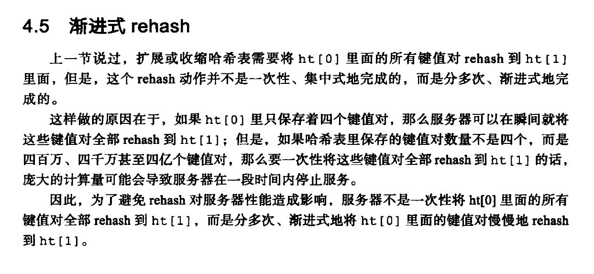

# Incremental rehash

Redis的`dict`采用的是incremental rehash。

在《Redis的设计与实现》chapter 《4.5 渐进式rehash》中有着非常好的介绍，这种"均摊"的思想是非常值得借鉴学习的，我将这种technique总结为: "incremental-amortize-not-all-at-once"，即"渐进式均摊而不是一蹴而就"。

## TODO

https://userpages.umbc.edu/~park/cs341.f18/projects/proj5.shtml

