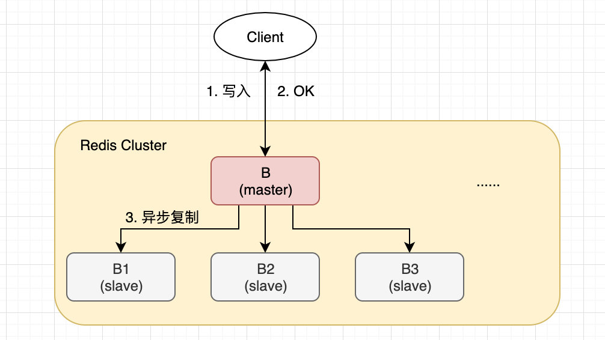
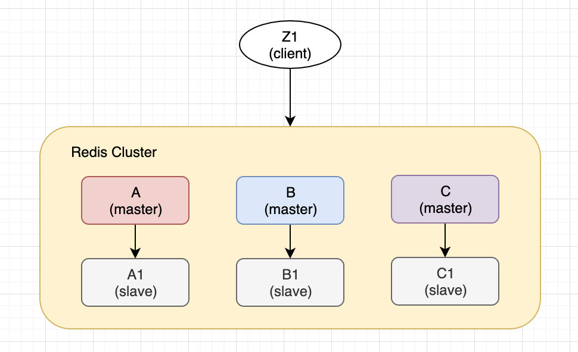

# Redis write safety分析

一、在 redis [Redis Cluster Specification](https://redis.io/topics/cluster-spec) 中，对此有着比较好的分析

二、csdn [Redis Cluster 会丢数据吗？](https://blog.csdn.net/duysh/article/details/103304134)

## csdn [Redis Cluster 会丢数据吗？](https://blog.csdn.net/duysh/article/details/103304134)

> NOTE: 
>
> 这篇文章总结地不错，可以作为  redis [Redis Cluster Specification](https://redis.io/topics/cluster-spec) 的补充材料

Redis Cluster 不保证强一致性，在一些特殊场景，客户端即使收到了写入确认，还是可能丢数据的。

### 场景1：异步复制

> NOTE: 
>
> 这种是比较容易理解的

- client 写入 master B
- master B 回复 OK
- master B 同步至 slave B1 B2 B3

B 没有等待 B1 B2 B3 的确认就回复了 client，如果在 slave 同步完成之前，master 宕机了，其中一个 slave 会被选为 master，这时之前 client 写入的数据就丢了。

`wait` 命令可以增强这种场景的数据安全性。

`wait` 会阻塞当前 client 直到之前的写操作被指定数量的 slave 同步成功。

`wait` 可以提高数据的安全性，但并不保证强一致性。

因为即使使用了这种同步复制方式，也存在特殊情况：一个没有完成同步的 slave 被选举为了 master。

### 场景2：网络分区

6个节点 `A, B, C, A1, B1, C1`，3个master，3个slave，还有一个client，`Z1`。

发生网络分区之后，形成了2个区，`A, C, A1, B1, C1` 和 `B Z1`。

这时 Z1 还是可以向 B 写入的，如果短时间内分区就恢复了，那就没问题，整个集群继续正常工作，但如果时间一长，B1 就会成为所在分区的 master，Z1 写入 B 的数据就丢了。

`maximum window（最大时间窗口）` 可以减少数据损失，可以控制 Z1 向 B 写入的总数：

> 过去一定时间后，分区的多数边就会进行选举，slave 成为 master，这时分区少数边的 master 就会拒绝接收写请求。

这个**时间量**是非常重要的，称为**节点过期时间**。

一个 master 在达到过期时间后，就被认为是故障的，进入 error 状态，停止接收写请求，可以被 slave 取代。

### 小结

Redis Cluster 不保证强一致性，存在丢失数据的场景：

- 异步复制

在 master 写成功，但 slave 同步完成之前，master 宕机了，slave 变为 master，数据丢失。

`wait` 命令可以给为同步复制，但也无法完全保证数据不丢，而且影响性能。

- 网络分区

分区后一个 master 继续接收写请求，分区恢复后这个 master 可能会变为 slave，那么之前写入的数据就丢了。

可以设置节点过期时间，减少 master 在分区期间接收的写入数量，降低数据丢失的损失。