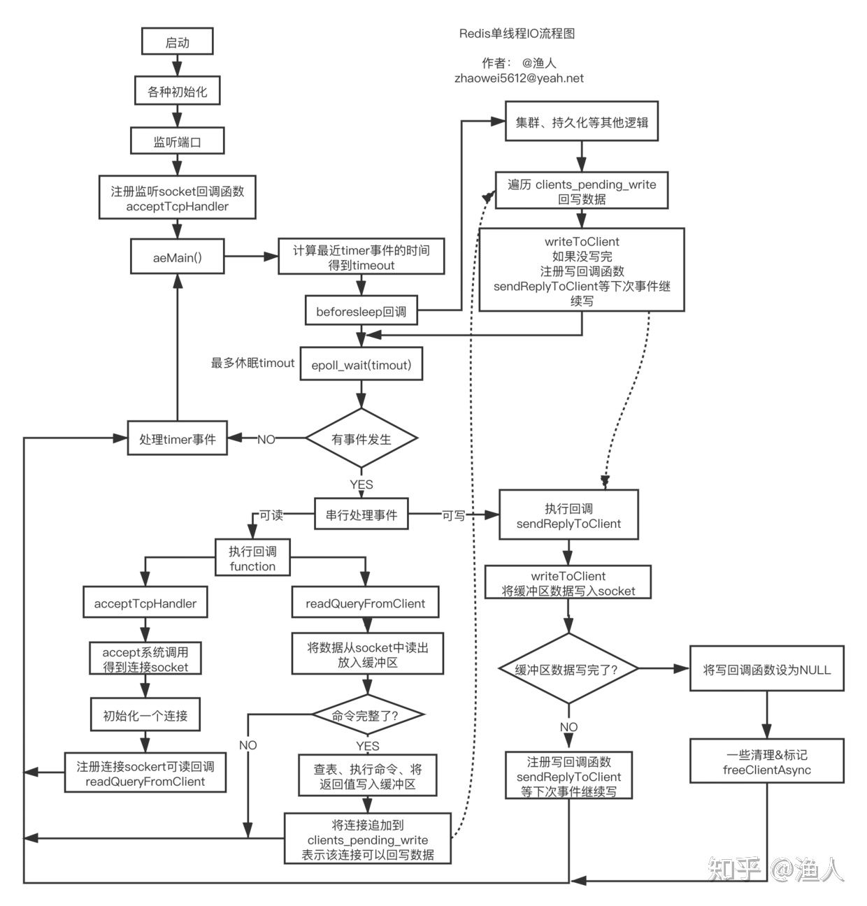
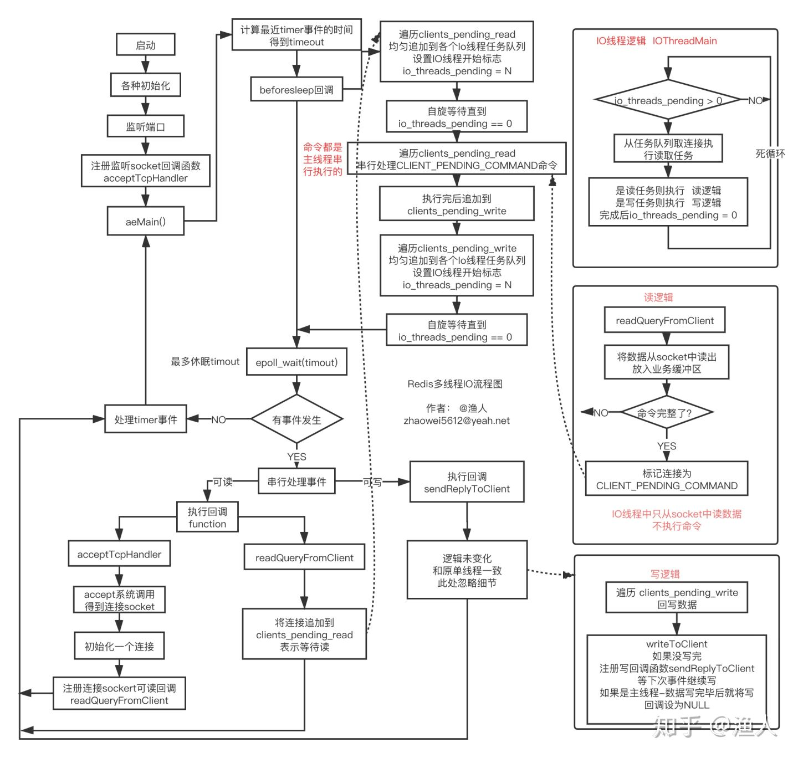

# zhihu [Redis 6.0 多线程IO处理过程详解](https://zhuanlan.zhihu.com/p/144805500)


## 异步处理IO

Redis 核心的工作负荷是一个单线程在处理， 但为什么还那么快？

1、其一是纯内存操作。

2、其二就是IO数据的处理是异步的，每个命令从接收到处理，再到返回，会经历多个“不连续”的工序。

（*为避免歧义，此处的**异步处理IO**不是“同步/异步IO”，特指IO**处理过程**是异步的，描述的对象是处理过程。*）

> NOTE: 
>
> 原文后面对Redis的**异步处理IO**进行说明

### Redis处理命令过程

假设客户端发送了以下命令：

```text
GET key-how-to-be-a-better-man？
```

redis回复:

```text
努力加把劲把文章写完
```

要处理命令，则redis必须完整地接收客户端的请求，并将命令解析出来，再将结果读出来，通过网络回写到客户端。整个工序分为以下几个部分：

1、接收。通过TCP接收到命令，可能会历经多次TCP包、ack、IO操作

> NOTE: read、input

2、解析。将命令取出来

3、执行。到对应的地方将value读出来

4、返回。将value通过TCP返回给客户端，如果value较大，则IO负荷会更重

> NOTE: write、output


其中解析和执行是纯cpu/内存操作，而接收和返回主要是IO操作，这是我们要关注的重点。以接收为例，redis要完整接收客户端命令，有两种策略：

1、**同步**: 接收客户端命令时一直等，直到接收到完整的命令，然后执行，再将结果返回，直到客户端收到完整结果， 然后才处理下一个命令。 这叫**同步**。 同步的过程中有很多等待的时间，例如有个客户端网络不好，那等它完整的命令就会更耗时。

2、**异步**: 客户端的TCP包来一个才处理一个，将数据追加到**缓冲区**，处理完了就去立即找其他事做，不等待，下一个TCP包来了再继续处理。命令的接收过程是穿插的，不连续。一会儿接收这个命令，一会儿又在接收另一个。 这叫做*异步*，过程中没有额外的空闲等待时间。

> NOTE: 
>
> 其实作者所述的"异步处理IO"，本质上是: "buffered-queued IO"，即无论是input还是output，都会进入到buffer中，待ready后，再执行，显然，这样就不需要等待

用聊天的例子做对应，假设你在回答多个人的问题，也有同步和异步的策略：

1、**同步**: 聊天框中显示“正在输入”时，你一直等ta输入完毕，然后回答ta的问题，再发送出去，发送时会有等待，常规表现就是有个圆圈在转。你等发送完毕后，才去回答另一个人的问题。 

2、**异步**: 显示“正在输入”时，不等ta，而是去回答其他输入完毕的问题，回答完后，不等发送完毕，又去回答其它问题。 


很显然异步的效率更高，要实现高并发必须要异步，因为同步有太多时间浪费在等待上了，遇到网络不好的客户端直接就被拖垮。异步的策略简单可总结如下：

1、网络包有数据了，就去读一下放到缓冲区，读完立马切到其他事情上，不等下一个包

2、解析下缓冲区数据是否完整。如完整则执行命令，不完整切到其他事情上

3、数据完整了，立即执行命令，将执行结果放到缓冲区

4、将数据给客户端，如果一次给不完，就等`下次能给时`再给，不等，直到全部给完

## 事件驱动

> NOTE: 
>
> 1、Redis event library `ae`
>
> 2、Linux epoll

## 单线程IO处理过程

redis启动后会进入一个死循环`aeMain`，在这个循环里一直等待事件发生，事件分为IO事件和timer事件，timer事件是一些定时执行的任务，如expire key等，本文只聊IO事件。

> NOTE: 
>
> event loop

epoll处理的是socket的可读、可写事件，当事件发生后提供一种高效的通知方式， 当想要异步监听某个socket的读写事件时，需要去事件驱动框架中注册要监听事件的socket，以及对应事件的回调function。然后死循环中可以通过epoll_wait不断地去拿发生了可读写事件的socket，依次处理即可。

1、`可读`可以简单理解为，对应的socket中有新的tcp数据包到来。

2、`可写`可以简单理解为，对应的socket写缓冲区已经空了(数据通过网络已经发给了客户端)

### 流程图

一图胜前言，完整、详细流程图如下：



> NOTE: 
>
> 右下角是完整的写过程

1、`aeMain()` 内部是一个死循环，会在`epoll_wait`处短暂休眠

2、`epoll_wait`返回的是当前可读、可写的socket列表

3、`beforeSleep`是进入休眠前执行的逻辑，核心是回写数据到socket

4、核心逻辑都是由IO事件触发，要么可读，要么可写，否则执行timer定时任务

5、第一次的IO可读事件，是监听socket(如监听6379的socket)，当有握手请求时，会执行`accept`调用，得到一个连接socket，注册可读回调`createClient`，往后客户端和redis的数据都通过这个socket进行

6、一个完整的命令，可能会通过多次`4`才能从socket读完，这意味这多次可读IO事件

7、命令执行的结果会写，也是这样，大概率会通过多次可写回调才能写完

8、当命令被执行完后，对应的连接会被追加到 `clients_pending_write`，`beforeSleep`会尝试回写到`socket`，写不完会注册可写事件，下次继续写

9、整个过程IO全部都是同步非阻塞，没有浪费等待时间

10、注册事件的函数叫`aeCreateFileEvent`

## 单线程IO的瓶颈

> NOTE: 
>
> Redis采用的是Reactor、同步非阻塞IO；read、write是同步的，这部分工作是会消耗大量的CPU时间的；这是Redis引入多线程IO的原因

同时这个模型有几个缺陷：

1、只能用一个cpu核(忽略后台线程)

2、如果value比较大，redis的QPS会下降得很厉害，有时一个大key就可以拖垮

3、QPS难以更上一层楼

redis主线程的时间消耗主要在两个方面：

1、逻辑计算的消耗

2、同步IO读写，拷贝数据导致的消耗

当value比较大时，瓶颈会先出现在同步IO上(假设带宽和内存足够)，这部分消耗在于两部分：

1、从socket中读取请求数据，会从内核态将数据拷贝到用户态 （read调用）

2、将数据回写到socket，会将数据从用户态拷贝到内核态 （write调用）

这部分数据读写会占用大量的cpu时间，也直接导致了瓶颈。 如果能有多个线程来分担这部分消耗，那redis的吞吐量还能更上一层楼，这也是redis引入多线程IO的目的。[3]

> NOTE: 
>
> 上述总结了Redis引入多线程的原因

## 多线程IO

上面已经梳理了单线程IO的处理流程，以及多线程IO要解决的问题，接下来将目光放到： 如何用多线程分担IO的负荷。其做法用简单的话来说就是：

1、用一组单独的线程专门进行 read/write socket读写调用 （同步IO）

> NOTE: 
>
> IO threads

2、**读回调函数**中不再读数据，而是将对应的连接追加到可读`clients_pending_read`的链表

3、主线程在`beforeSleep`中将**IO读任务**分给IO线程组

4、主线程自己也处理一个**IO读任务**，并**自旋式**等IO线程组处理完，再继续往下

5、主线程在`beforeSleep`中将**IO写任务**分给IO线程组

6、主线程自己也处理一个**IO写任务**，并**自旋式**等IO线程组处理完，再继续往下

7、IO线程组要么同时在读，要么同时在写

8、命令的执行由主线程串行执行(保持单线程)

9、IO线程数量可配置

### 完整流程图



> NOTE: 
>
> 命令的执行放到了`beforeSleep`回调中了

`beforesleep`中，先让IO线程读数据，然后再让IO线程写数据。 读写时，多线程能并发执行，利用多核。

1、将**读任务**均匀分发到各个IO线程的任务链表`io_threads_list[i]`，将`io_threads_pending[i]` 设置为对应的任务数，此时IO线程将从死循环中被激活，开始执行任务，执行完毕后，会将 `io_threads_pending[i]`清零。 函数名为： `handleClientsWithPendingReadsUsingThreads`

2、将**写任务**均匀分发到各个IO线程的任务链表`io_threads_list[i]`，将`io_threads_pending[i]` 设置为对应的任务数，此时IO线程将从死循环中被激活，开始执行任务，执行完毕后，会将 `io_threads_pending[i]`清零。 函数名为： handleClientsWithPendingWritesUsingThreads

3、`beforeSleep`中主线程也会执行其中一个任务(图中忽略了)，执行完后自旋等待IO线程处理完。

4、读任务要么在beforeSleep中被执行，要么在IO线程被执行，不会再在读回调中执行

5、写任务会分散到 beforeSleep、IO线程、写回调中执行

6、主线程和IO线程交互是无锁的，通过**标志位**设置进行，不会同时写任务链表

性能据测试提升了一倍以上(4个IO线程)。 [4]

欢迎您的提问、指正、建议等。